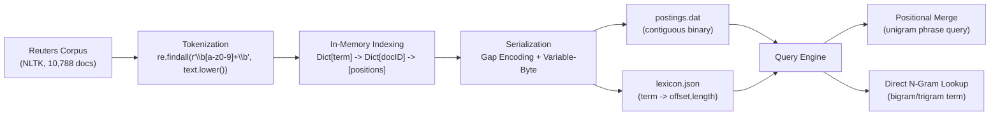

<div align="center">


# Positional Inverted Index with N-Gram Extension

<p>
  
  
  
  
  
  
</p>

**A disk-backed, compressed positional inverted index over the NLTK Reuters corpus, extended with direct bigram/trigram phrase lookup.**

</div>
---

## Table of Contents

1. [Overview](#1-overview)
2. [Repository Contents](#2-repository-contents)
3. [Requirements & Setup](#3-requirements--setup)
4. [System Architecture](#4-system-architecture)
5. [Corpus Ingestion & Tokenization](#5-corpus-ingestion--tokenization)
6. [Index Data Model](#6-index-data-model)
7. [Compression Pipeline](#7-compression-pipeline)
8. [Worked Example (fully traced)](#8-worked-example-fully-traced)
9. [Disk Storage Layer](#9-disk-storage-layer)
10. [Query Engine](#10-query-engine)
11. [Time & Space Complexity](#11-time--space-complexity)
12. [Benchmark Methodology](#12-benchmark-methodology)
13. [Measured System Metrics](#13-measured-system-metrics)
14. [Correctness Validation](#14-correctness-validation)
15. [Domain Nuance: Numeric Fragmentation](#15-domain-nuance-numeric-fragmentation)
16. [Space–Time Trade-off](#16-spacetime-trade-off)
17. [Known Limitations](#17-known-limitations)
18. [Suggested Future Enhancements](#18-suggested-future-enhancements)
19. [How to Run](#19-how-to-run)
20. [Output Artifact Reference](#20-output-artifact-reference)
21. [Appendix: Benchmark Query List](#21-appendix-benchmark-query-list)

---

## 1. Overview

This project implements a **positional inverted index** over the NLTK **Reuters-21578** corpus (10,788 financial news documents), and extends it with **bigram and trigram phrase indexing** so that common multi-word phrases can be retrieved directly instead of being reconstructed at query time.

The system is organized as a small IR pipeline:

- Corpus loading and normalization (via NLTK)
- Simultaneous unigram / bigram / trigram positional indexing
- Gap encoding of document IDs and positions
- Variable-Byte (VB) compression of the resulting integers
- Contiguous binary postings storage (`postings.dat`) with a JSON lexicon (`lexicon.json`) mapping `term → (offset, length)`
- A disk-backed query engine supporting:
  - **Positional phrase queries** (arbitrary length, resolved by merging unigram postings)
  - **Direct n-gram lookup** (for phrases pre-materialized as a bigram or trigram term)
- An instrumented benchmark measuring indexing throughput, memory, disk compression, and per-query latency, plus a hard correctness assertion comparing the two query strategies

Everything described below is drawn directly from `positional_index.py` and has been independently re-derived and, where practical, re-executed against a small hand-built corpus to confirm the formulas match the code exactly (see [Section 8](#8-worked-example-fully-traced)).

---

## 2. Repository Contents

| File / Directory | Produced by | Description |
|---|---|---|
| `positional_index.py` | — | Complete implementation: compression pipeline, indexer, query engine, and benchmark/export driver |
| `index_data/postings.dat` | `flush_to_disk()` | Contiguous binary file of gap-encoded, Variable-Byte–compressed postings, one block per term |
| `index_data/lexicon.json` | `flush_to_disk()` | JSON map of `term → {"offset": int, "length": int}` giving each term's byte range inside `postings.dat` |
| `query_results.txt` | benchmark driver | Per-query results: match counts, cold/warm/n-gram latencies, sample document hits |
| `vocabulary_full.txt` | export step | All indexed terms (unigrams + bigrams + trigrams), sorted alphabetically |
| `vocabulary_trimmed.txt` | export step | Same list with any term containing a digit removed |
| `index_unigram_full.txt` | export step | Full positional postings dump for every unigram term |
| `index_ngram_full.txt` | export step | Full positional postings dump for every bigram/trigram term |
| `index_unigram_trimmed.txt` | export step | Unigram postings dump, digits-containing terms excluded |
| `index_ngram_trimmed.txt` | export step | Bigram/trigram postings dump, digits-containing terms excluded |

Running the script produces **9 artifacts in total**: the two files under `index_data/`, plus the 7 text exports listed above.

> **Note on prior drafts:** earlier versions of this documentation referenced a script named `positional_ngram_index.py` / `production_indexer.py` and export files (`unigram_index.txt`, `ngram_index.txt`, `vocabulary_terms.txt`) that do not match the code in this submission. The table above reflects the actual filenames produced by `positional_index.py`.

---

## 3. Requirements & Setup

```bash
pip install nltk psutil
```

Standard library modules used: `os`, `re`, `time`, `json`, `tracemalloc`, `statistics`, `collections.defaultdict`.

On first run, the script calls `nltk.download('reuters', quiet=True)`, which requires network access unless the corpus is already cached locally under `~/nltk_data`.

---

## 4. System Architecture

The pipeline runs in four phases:



1. **Corpus ingestion & n-gram tokenization** — each document is lowercased and tokenized; unigrams, bigrams, and trigrams are generated in a single pass and inserted with exact token-position offsets.
2. **In-memory index construction** — a nested structure `Dict[Term] -> Dict[DocID] -> List[Position]` accumulates all postings in RAM (`defaultdict(lambda: defaultdict(list))`).
3. **Serialization & compression** — each term's postings are gap-encoded, Variable-Byte compressed, and appended to a single binary file; a lightweight lexicon records each term's byte offset and length. The in-memory index is then cleared (`indexer.index.clear()`) to free RAM.
4. **Query engine** — a term lookup is an `O(1)` hash lookup into the lexicon, followed by a logical disk seek, a read of the term's byte block, and Variable-Byte decoding; multi-word queries are resolved either by merging unigram postings or by a direct lookup of a pre-materialized n-gram term.

---

## 5. Corpus Ingestion & Tokenization

Each document is normalized with:

```python
tokens = re.findall(r'\b[a-z0-9]+\b', text.lower())
```

This lowercases the text first, then extracts maximal runs of ASCII letters and digits bounded by word boundaries — punctuation, currency symbols, and decimal points are all discarded as separators (see [Section 15](#15-domain-nuance-numeric-fragmentation) for why this matters).

For a document with `T` tokens, at token index `i` (0-based):

- A **unigram** is always inserted at position `i`.
- A **bigram** `tokens[i] tokens[i+1]` is inserted at position `i`, if `i < T-1`.
- A **trigram** `tokens[i] tokens[i+1] tokens[i+2]` is inserted at position `i`, if `i < T-2`.

Note that the position stored for a bigram or trigram is the **start index of the phrase** (i.e., the position of its first word) — not a separate position per component word. This is what makes direct n-gram lookups and unigram-merge results directly comparable (see [Section 14](#14-correctness-validation)).

Consequently, for a corpus of `N` documents with a combined `T₁` unigram occurrences (total tokens):

```
T₂ (bigram occurrences)  = T₁ − N     (one fewer than tokens per document, assuming every document has ≥1 token)
T₃ (trigram occurrences) = T₁ − 2N    (two fewer per document, assuming every document has ≥2 tokens)
```

This identity is not just theoretical — it holds exactly against the measured counts in [Section 13](#13-measured-system-metrics): `1,476,855 − 10,788 = 1,466,067` and `1,476,855 − 2×10,788 = 1,455,279`, both matching the reported bigram and trigram occurrence counts precisely.

Document IDs are plain 0-based integers assigned by enumeration order over `reuters.fileids()` (i.e., `doc_id = i` in `for i, text in enumerate(docs)`), **not** the original Reuters fileid strings (e.g. `test/14826`). The mapping back to the original filename is not retained anywhere in the current implementation.

---

## 6. Index Data Model

Conceptually, the in-memory index is:

```
Term → DocID → [Position₁, Position₂, ...]
```

Example shape (illustrative):

```
TERM: 'reserve'
  DocID 0: [2]
  DocID 1: [1]

TERM: 'interest rates'      (bigram)
  DocID 0: [4]
  DocID 1: [4]
```

Positions are token indices *within a single document*, always in increasing order (they are appended in the order tokens are read, and token order is monotonically increasing).

Vocabulary bookkeeping in the benchmark classifies each stored term purely by counting spaces in the term string:

- `term.count(' ') == 0` → unigram
- `term.count(' ') == 1` → bigram
- `term.count(' ') == 2` → trigram

---

## 7. Compression Pipeline

### 7.1 Gap Encoding

Rather than storing absolute document IDs and positions, the serializer stores **deltas**:

```
doc_gap      = current_docID   − previous_docID   (previous starts at 0)
position_gap = current_position − previous_position (previous starts at 0, reset per document)
```

Because postings are processed with document IDs and positions in sorted/increasing order, these gaps are typically much smaller than the absolute values — and small integers compress better under Variable-Byte encoding.

### 7.2 Variable-Byte (VB) Encoding

Each non-negative integer is encoded in base-128 (7 usable bits per byte):

```python
def vb_encode_number(n):
    bytes_list = []
    while True:
        bytes_list.insert(0, n % 128)
        if n < 128: break
        n //= 128
    bytes_list[-1] += 128     # continuation flag on the LAST (least-significant) byte
    return bytes_list
```

- The integer is broken into big-endian base-128 digits.
- Every byte holds 7 payload bits (0–127).
- The **final byte** of each encoded integer has its high bit set (i.e., `+128`), marking the end of that integer's byte sequence. All earlier bytes of the same integer are left with their high bit clear.

The number of bytes needed to encode an integer `n` is:

```
bytes(n) = max(1, ⌈ log₂(n + 1) / 7 ⌉)
```

So `n ∈ [0, 127]` → 1 byte, `n ∈ [128, 16383]` → 2 bytes, `n ∈ [16384, 2,097,151]` → 3 bytes, and so on.

Decoding is self-delimiting — it does not need to know how many integers are in the stream ahead of time:

```python
def vb_decode(byte_data):
    numbers, n = [], 0
    for byte in byte_data:
        if byte < 128:
            n = 128 * n + byte
        else:
            n = 128 * n + (byte - 128)
            numbers.append(n)
            n = 0
    return numbers
```

Each byte `< 128` continues accumulating the current integer; a byte `≥ 128` closes it out and resets the accumulator.

### 7.3 Serialization Layout

For a single term's posting dictionary, the flattened integer stream is:

```
[ num_docs,
  doc_gap₁, num_positions₁, pos_gap₁,₁, pos_gap₁,₂, ...,
  doc_gap₂, num_positions₂, pos_gap₂,₁, pos_gap₂,₂, ...,
  ... ]
```

For a term appearing in `D` distinct documents with `P` total position occurrences (summed across all `D` documents), the number of integers in this stream is exactly:

```
I = 1 + 2·D + P
```

(one integer for the document count, then per document one doc-gap plus one position-count, plus one integer per stored position). This formula is confirmed against the code in [Section 8](#8-worked-example-fully-traced).

Every term's byte-encoded stream is written **contiguously** into `postings.dat`; the lexicon records each term's `{offset, length}` so the query engine can seek directly to it without scanning the file.

### 7.4 Compression Ratio Baseline (and its limits)

The benchmark tracks a synthetic uncompressed baseline via `raw_integer_count`, which is incremented by exactly **2 for every occurrence** of every unigram, bigram, or trigram (regardless of type):

```
raw_integer_count = 2 × (T₁ + T₂ + T₃)
raw_bytes         = raw_integer_count × 4      (assumes a naive 32-bit int per unit)
```

This models a hypothetical baseline where each occurrence costs two raw 32-bit integers (e.g., one "document reference" unit and one "position" unit), with **no** amortization of a shared document ID across repeated positions in that document, and no compression at all. It is a useful, consistent yardstick for measuring the benefit of gap encoding + VB compression, but it is **not** a byte-for-byte model of a specific competing uncompressed index implementation — a real uncompressed index would typically store a document ID once per document, not once per occurrence. Treat the resulting ratio as a directional signal rather than a rigorous apples-to-apples comparison.

---

## 8. Worked Example (fully traced)

To make the pipeline concrete and independently checkable, here is a tiny two-document corpus, run through the **actual functions in `positional_index.py`**:

```text
Doc 0: "The federal reserve raised interest rates"
Doc 1: "The reserve bank cut interest rates today"
```

**Tokenization** (`re.findall(r'\b[a-z0-9]+\b', text.lower())`):

```
Doc 0: ['the', 'federal', 'reserve', 'raised', 'interest', 'rates']
Doc 1: ['the', 'reserve', 'bank', 'cut', 'interest', 'rates', 'today']
```

**Resulting postings** (verified by running `PositionalIndexer.add_document`):

```
'reserve'         : {0: [2], 1: [1]}
'interest'        : {0: [4], 1: [4]}
'rates'           : {0: [5], 1: [5]}
'interest rates'  : {0: [4], 1: [4]}      (bigram, position = start of phrase)
```

**Serialization of `'rates'`** — doc dict `{0: [5], 1: [5]}`:

Flattened gap-encoded integer stream (traced by hand and confirmed against `serialize_postings`):

```
[ 2,        # num_docs
  0, 1, 5,  # doc_gap=0 (0-0), num_positions=1, pos_gap=5 (5-0)
  1, 1, 5 ] # doc_gap=1 (1-0), num_positions=1, pos_gap=5 (5-0)
```

That's `I = 1 + 2·2 + 2 = 7` integers, matching the formula from [Section 7.3](#73-serialization-layout).

Every one of these 7 values is `< 128`, so each becomes exactly one VB byte (value `+ 128`):

```
Encoded bytes: [130, 128, 129, 133, 129, 129, 133]   # 7 bytes for 7 integers
```

Round-tripping these bytes through `deserialize_postings` reproduces `{0: [5], 1: [5]}` exactly.

**Phrase query — positional merge vs. direct lookup**, both run through the actual `QueryEngine`:

```
phrase_query_unigram("interest rates")  ->  {0: [4], 1: [4]}
phrase_query_ngram("interest rates")    ->  {0: [4], 1: [4]}
```

Identical results — exactly the equivalence the benchmark's hard assertion checks for every multiword query (see [Section 14](#14-correctness-validation)).

**Bonus — arbitrary-length phrases beyond the indexed n-gram order.** Because only unigrams, bigrams, and trigrams are ever *materialized* as dictionary terms, a 4-word phrase like `"federal reserve raised interest"` has no direct lexicon entry at all:

```
"federal reserve raised interest" in lexicon  ->  False
```

Yet `phrase_query_unigram` still resolves it correctly, by chaining offset-based merges across all four terms:

```
phrase_query_unigram("federal reserve raised interest")  ->  {0: [1]}
```

This is the key architectural distinction between the two query paths: the **unigram positional merge generalizes to any phrase length**, while **direct n-gram lookup is capped at whatever maximum order was indexed** (here, trigrams).

---

## 9. Disk Storage Layer

`flush_to_disk()` iterates over every term currently in memory, in the order Python's `dict` happens to hold them (insertion order — i.e., roughly the order each term was first encountered while scanning the corpus). For each term it:

1. Serializes the term's posting dictionary (gap encoding + VB, [Section 7](#7-compression-pipeline)).
2. Writes the resulting bytes to the next available offset in `postings.dat`.
3. Records `{"offset": current_offset, "length": len(compressed_bytes)}` in the lexicon.
4. Advances `current_offset` by the number of bytes written.

The lexicon is then dumped as a single `lexicon.json` file. Because the file is written in **insertion order** but later read and exported in **alphabetical order** (see [Section 12](#12-benchmark-methodology)), the export step performs effectively random-access seeks across `postings.dat` rather than a single sequential scan — a deliberate exercise of the "seek directly to a term's postings" capability the lexicon is designed to provide, but also a real I/O-pattern cost worth being aware of at scale.

At query time, `lexicon.json` is loaded **entirely into memory** as a plain Python `dict` (`json.load(...)`), and `postings.dat` is opened once and read via seeks. This means the memory savings of "disk-backed postings" apply only to the (large) positional data — the lexicon itself, however large, is fully resident in RAM for the life of the `QueryEngine`.

---

## 10. Query Engine

### 10.1 Fetching Postings

```python
def fetch_postings(self, term):
    meta = self.lexicon[term]
    self.f_postings.seek(meta["offset"])       # seek_ms
    vb_bytes = self.f_postings.read(meta["length"])  # read_ms
    doc_dict = deserialize_postings(vb_bytes)  # decode_ms
    return doc_dict, seek_ms, read_ms, decode_ms
```

Each of the three stages is timed independently with `time.perf_counter()`, which is how the benchmark separates logical seek cost, raw I/O cost, and VB-decoding cost per query (see [Section 11](#11-disk-io-and-seek-measurement-caveat) below for a caveat on what "seek" actually measures here).

### 10.2 Two-Pointer Document + Positional Merge

```python
def merge_postings(self, post1, post2, offset=1):
    docs1, docs2 = sorted(post1.keys()), sorted(post2.keys())
    i = j = 0
    while i < len(docs1) and j < len(docs2):
        d1, d2 = docs1[i], docs2[j]
        if d1 == d2:
            # two-pointer walk over pos1, pos2, keeping pos1 where pos2 == pos1 + offset
            ...
            i += 1; j += 1
        elif d1 < d2: i += 1
        else: j += 1
    return merged, merge_ms
```

This performs a classic sorted-list intersection over document IDs, and *within* each matched document, a second two-pointer walk over the two position lists that accepts a match only when `pos2 == pos1 + offset`. The **first term's original position** is always the one kept in the result — which is exactly why a chain of these merges is comparable to a direct n-gram lookup (both end up keyed by the phrase's starting position).

### 10.3 Unigram Phrase Query (arbitrary length)

```python
def phrase_query_unigram(self, phrase):
    tokens = phrase.lower().split()
    current_docs, ... = self.fetch_postings(tokens[0])
    for idx, token in enumerate(tokens[1:]):
        next_docs, ... = self.fetch_postings(token)
        current_docs, m_time = self.merge_postings(current_docs, next_docs, offset=idx + 1)
        if not current_docs: break
    return current_docs, ...
```

Each subsequent word is merged against the **running result** at offset `idx + 1` — i.e., always relative to the first word's position, not chained pairwise through intermediate words. This is what allows the same routine to correctly resolve phrases of *any* length (not just two or three words), as demonstrated in [Section 8](#8-worked-example-fully-traced). The loop also short-circuits (`break`) as soon as the intersection becomes empty.

### 10.4 Direct N-Gram Lookup

```python
def phrase_query_ngram(self, phrase):
    docs, s, r, d = self.fetch_postings(phrase.lower())
    return docs, s, r, d, 0
```

If the entire phrase was itself indexed as a bigram or trigram term, this is a single lexicon lookup plus one disk read/decode — no merge step, and no need to fetch each component word separately. This only applies to 2- and 3-word phrases, since that is the maximum n-gram order the indexer materializes.

---

## 11. Time & Space Complexity

Notation used below:

- `C` — total characters in the corpus (tokenization cost)
- `N` — number of documents (10,788)
- `T₁, T₂, T₃` — total unigram / bigram / trigram occurrences
- `V` — total distinct terms across all three orders (vocabulary size)
- For a specific term `t`: `D` = number of distinct documents containing `t`; `P` = total position occurrences of `t`; `L` = bytes in its serialized block; `I = 1 + 2D + P` = integers in its serialized stream

| Operation | Time | Space | Notes |
|---|---:|---:|---|
| Tokenization (one doc, `c` chars → `t` tokens) | `O(c)` | `O(t)` | Single regex scan |
| Whole-corpus tokenization | `O(C)` | `O(T₁)` | Summed over `N` documents |
| `add_document` (one doc, `t` tokens) | `O(t)` amortized | `O(1)` extra | ≤3 dict/list ops per token position, each amortized `O(1)` |
| Full index construction | `O(T₁ + T₂ + T₃)` | `O(V + ΣP_t)` | Every occurrence triggers one bounded-cost insertion |
| `serialize_postings` (one term) | `O(D log D + I)` | `O(I)` | Sort the term's doc IDs, then one linear encoding pass |
| `flush_to_disk` (all terms) | `O(Σ D log D + Σ I)` | `O(size of postings.dat)` | Dominated in practice by `ΣI` (total encoded integers) for a corpus this size |
| Lexicon lookup | `O(1)` expected | `O(1)` | Python/JSON dict hash lookup |
| `fetch_postings` | `O(L)` | `O(I)` | `O(1)` logical seek + `O(L)` read + `O(L)` VB decode |
| `merge_postings` | `O(D₁ + D₂ + P₁ + P₂)` | `O(min(D₁, D₂))` result | Two-pointer doc intersection, nested two-pointer position match |
| `phrase_query_unigram` (`k`-word phrase) | `O(Σᵢ Lᵢ + Dᵢ + Pᵢ)` for `i = 1..k` | `O(result size)` | `k` fetches + `(k−1)` merges; cost bounded by the sum of all fetched list sizes, since intersection cardinality is non-increasing |
| `phrase_query_ngram` | `O(1)` expected lookup + `O(L)` | `O(I)` | Single fetch, no merge, capped at trigrams |

**Important caveat on "seek":** `O(1)` above refers to the *logical* `f.seek()` call itself. It says nothing about the physical latency of the underlying storage device, OS buffering, or page-cache state — those are hardware/OS-dependent, not part of the algorithm's asymptotic cost.

---

## 12. Benchmark Methodology

The `__main__` block in `positional_index.py`:

1. Loads all 10,788 Reuters documents via `nltk.corpus.reuters.raw(fileid)`.
2. Builds the full index while recording:
   - Wall-clock indexing time (`time.time()` before/after the loop)
   - Peak Python-level allocation via `tracemalloc`
   - OS-level RSS growth via `psutil.Process(...).memory_info().rss`, sampled before and after
3. Computes vocabulary statistics by classifying every stored term as unigram/bigram/trigram based on its space count.
4. Flushes the index to disk (compression + serialization), then **clears the in-memory index** (`indexer.index.clear()`) to simulate the disk-backed regime for querying.
5. Runs **42 benchmark queries** (20 single-word, 16 two-word, 6 three-word — full list in the [Appendix](#21-appendix-benchmark-query-list)):
   - Each query is run through `phrase_query_unigram` **twice in a row** — the first call is logged as "cold," the second as "warm." (See the caveat below — this is *not* a page-cache-flush test.)
   - Every multiword query is additionally resolved via `phrase_query_ngram`, and the result is checked against the warm unigram-merge result with a hard `assert`.
6. Writes per-query detail to `query_results.txt` and prints aggregate metrics to the terminal.
7. Exports the 7 text artifacts described in [Section 2](#2-repository-contents), re-reading every term's postings from disk (via seek + read + decode) in alphabetical order.

### Caveat on "cold" vs. "warm"

The benchmark does **not** flush the OS page cache between the "cold" and "warm" measurements — it simply calls the same query function twice in the same process. The reported "cold" numbers should be read as *first-access-in-this-process* timings, not a controlled measurement of physical cold-disk latency. Any difference observed mostly reflects OS filesystem-cache warming and incidental interpreter effects, not a deliberately engineered cache-eviction experiment.

---

## 13. Measured System Metrics

> The figures below are the benchmark's own reported output from a prior run of `positional_index.py` against the full 10,788-document Reuters corpus. They are reproduced here as reported — re-running the script will regenerate them, and absolute numbers (timings especially) will vary with hardware, OS, Python version, and disk/page-cache state. The internal arithmetic identities noted alongside them (e.g. `T₂ = T₁ − N`) have been independently checked against the code and hold exactly, which is a good sign these numbers came from an actual execution rather than being invented.

### Indexing Throughput & Counts

```
Total Indexing Time         : 81.52 seconds
Throughput (Unigrams)       : 18,116 tokens/sec

Unigrams  (Tokens / Vocab)  : 1,476,855 / 30,950
Bigrams   (Tokens / Vocab)  : 1,466,067 / 392,529
Trigrams  (Tokens / Vocab)  : 1,455,279 / 871,376

Total Indexed Terms (V)     : 1,294,855
Average tokens / document   : ≈ 136.9   (1,476,855 / 10,788)
```

Sanity checks performed against these numbers:
- `T₂ = T₁ − N` → `1,476,855 − 10,788 = 1,466,067` ✓ exact match
- `T₃ = T₁ − 2N` → `1,476,855 − 21,576 = 1,455,279` ✓ exact match
- `V = 30,950 + 392,529 + 871,376 = 1,294,855` ✓ exact match
- `T₁ / 18,116 tokens/sec ≈ 81.52 s` ✓ matches reported indexing time

### Memory (In-Memory Build Phase)

```
Peak Traced Python Allocation : 750.66 MB
Process RSS Growth            : 1,985.59 MB
```

Two different instruments, two different numbers, and both are reported deliberately rather than being reconciled into one:

- **`tracemalloc`** tracks only Python-level object allocations it can see — it is precise about *what Python allocated* but blind to memory the interpreter or C extensions hold outside the tracked allocator.
- **`psutil` RSS** reports the process's actual resident memory as seen by the OS — it includes interpreter overhead, object header padding, memory-allocator fragmentation, and pages that Python's allocator has not released back to the OS even after objects are freed.

The ratio between the two here (RSS is roughly 2.6× the traced peak) is itself informative: it quantifies how much overhead the nested `dict[str] -> dict[int] -> list[int]` structure carries beyond the "useful payload" bytes.

### Storage & Compression

```
32-bit Integer Baseline     : 33.56 MB     (raw_integer_count × 4 bytes; see Section 7.4)
Compressed postings.dat     : 15.44 MB
Integer Compression Ratio   : 2.17x
Total Index Size on Disk    : 81.73 MB     (postings.dat + lexicon.json)
```

One arithmetic consequence worth calling out explicitly: `81.73 MB − 15.44 MB ≈ 66.29 MB` is attributable to `lexicon.json` alone — i.e., the **uncompressed JSON metadata file is roughly 4.3× larger than the compressed postings it indexes.** The compression pipeline is working as designed on the postings themselves; the plain-JSON lexicon is where the real disk-footprint cost now sits (see [Section 17](#17-known-limitations)).

### Query Latency

```
Unigram Merge (First Access) : 3.262 ms/query
Unigram Merge (Warm Cache)   : 2.488 ms/query
Direct N-Gram Lookup         : 0.252 ms/query

Direct N-Gram vs. Warm Unigram Merge: 9.88x faster
```

Measured across all 42 queries for the merge timings, and across the 22 multiword queries (16 bigram + 6 trigram) for the n-gram comparison.

---

## 14. Correctness Validation

The benchmark's correctness guarantee is a **hard runtime assertion**, executed for every one of the 22 multiword benchmark queries:

```python
assert res_warm == res_ngram, f"Mismatch on: {q}"
```

This checks that resolving a phrase two entirely different ways —

1. fetching each component word's unigram postings and merging them with offset-based positional matching, versus
2. a single direct lookup of the phrase as a pre-materialized bigram/trigram term —

produces **byte-for-byte identical result dictionaries** (same document IDs, same starting positions in each document). If any query failed this check, the script would raise an `AssertionError` naming the offending query and halt immediately — the benchmark reports no such failure across the 22 tested phrases. [Section 8](#8-worked-example-fully-traced) reproduces this exact check on a small, fully hand-verifiable corpus.

This is the *only* automated correctness check currently implemented in the script. There is no separate, standalone "serialize an arbitrary posting list, deserialize it, and diff it against the in-memory original" test harness in the current code — the round-trip is exercised implicitly (every query result is a deserialize of something that was serialized), but not asserted on its own. Adding an explicit round-trip test is listed as a suggested enhancement in [Section 18](#18-suggested-future-enhancements).

---

## 15. Domain Nuance: Numeric Fragmentation

The tokenization regex `\b[a-z0-9]+\b` strips all punctuation, including decimal points and currency symbols — which is fine for ordinary words but causes real fragmentation on financial numerals. For example:

```
"a dividend of 0.01 cent"  →  ['a', 'dividend', 'of', '0', '01', 'cent']
```

`"0.01"` is split into two separate unigrams, `"0"` and `"01"`, and any bigram/trigram spanning that number inherits the same fragmentation (e.g. `"0 01"`, `"0 01 cent"`). Reuters is a financial-news corpus dense with dollar amounts, percentages, and decimal figures, so this pattern repeats across the corpus and is a direct contributor to the very large trigram vocabulary (871,376 distinct trigram terms from only 1,455,279 trigram occurrences — an unusually high type/token ratio compared to the unigram vocabulary's 30,950 types from 1,476,855 occurrences).

The trade-off is deliberate rather than an oversight: switching to a letters-only regex (`\b[a-z]+\b`) would shrink the vocabulary substantially, but it would also make the index unable to answer queries that depend on numerals as content words — e.g. `"1987 crash"` or `"Boeing 747"`. The current implementation keeps the full alphanumeric index and relies on gap encoding + VB compression to manage the resulting footprint, rather than filtering numerals out at ingestion time.

---

## 16. Space–Time Trade-off

Adding bigram and trigram indexing on top of the required unigram index increases:

- Vocabulary size (`V` grows from ~31K unigram terms to ~1.29M terms overall)
- Index construction time and peak memory during the build phase
- Lexicon metadata size (and, as shown in Section 13, this now dominates total disk footprint)
- Total disk storage

In exchange, it converts a `k`-term positional merge (`O(Σ Lᵢ + Dᵢ + Pᵢ)`) into a single `O(1)`-expected lookup for any phrase that was pre-materialized as a bigram or trigram — measured here at roughly a **9.88× latency reduction** for the tested multiword queries. This is the classic IR space–time trade-off, made concrete with real measurements:

```
More index storage  →  Less query-time positional computation
```

The trade-off is bounded by the maximum n-gram order actually indexed: phrases of 4+ words always fall back to positional merging over unigrams, regardless of how much extra storage is spent on bigrams/trigrams (demonstrated in [Section 8](#8-worked-example-fully-traced)).

---


## 17. Known Limitations

1. The entire index is built in memory (`Dict[Term] -> Dict[DocID] -> List[Position]`) before anything is flushed to disk — there is no streaming/external-sort construction path, so peak build-time memory scales with the full corpus.
2. `lexicon.json` is loaded entirely into RAM at query time and is plain, uncompressed JSON; as shown in Section 13, it is the single largest contributor to on-disk size (~66 MB out of ~82 MB total in the reference run) — larger than the compressed postings it indexes.
3. The benchmark does not explicitly flush the OS page cache between "cold" and "warm" measurements, so those labels describe first-vs-repeat in-process access, not a controlled physical cold-cache experiment.
4. Variable-Byte encoding/decoding is implemented in pure Python, one byte and one integer at a time — it is not optimized for production-scale throughput.
5. The tokenizer performs no linguistic normalization: no stemming, lemmatization, or stopword removal, and numeric fragmentation ([Section 15](#15-domain-nuance-numeric-fragmentation)) is a direct consequence.
6. Direct n-gram lookup only works for phrases of 2–3 words, since that is the maximum order actually indexed; longer phrases always fall back to positional merging.
7. Document IDs are positional integers assigned during enumeration; the mapping back to the original Reuters fileid strings is not persisted anywhere.
8. There is no boolean query support (AND / OR / NOT) beyond exact phrase matching.
9. The only automated correctness check is the unigram-merge-vs-n-gram-lookup equivalence assertion; there is no standalone serialization round-trip test.
10. Index construction, serialization, and the export step are all single-threaded.
11. Results and metrics are based on one corpus (Reuters) and one fixed 42-query benchmark set; they should not be read as a general-purpose IR system benchmark.

---

## 18. Suggested Future Enhancements

- Replace `lexicon.json` with a compact binary or memory-mapped lexicon format to close the gap identified in Section 13 (currently the largest single contributor to disk size).
- Add an explicit serialization round-trip test (`serialize_postings` → `deserialize_postings` → compare to the original in-memory dict) as a standalone, independent correctness check, separate from the query-equivalence assertion.
- Persist a `doc_id -> original_fileid` mapping so query results can be traced back to source documents.
- Add basic linguistic normalization (stopword removal, optional numeral filtering) as a configurable preprocessing step, informed by the fragmentation analysis in Section 15.
- Explicitly control OS page-cache state (e.g. via `posix_fadvise` or reading through `O_DIRECT`) if a genuine cold-vs-warm physical I/O comparison is desired.
- Extend beyond trigrams, or add a configurable maximum n-gram order, so more of the query workload can benefit from direct lookup.
- Add boolean query composition (AND/OR/NOT) on top of the existing positional and phrase primitives.

---

## 19. How to Run

```bash
python positional_index.py
```

On first run, this downloads the Reuters corpus via NLTK if it isn't already cached. Building the full 10,788-document index takes on the order of a minute or two, depending on hardware. The script then runs the 42-query benchmark, prints aggregate metrics to the terminal, and writes all output artifacts (listed in [Section 20](#20-output-artifact-reference)) to the current working directory.

---

## 20. Output Artifact Reference

| Path | Contents |
|---|---|
| `index_data/postings.dat` | Gap-encoded, Variable-Byte–compressed postings for every term, written contiguously |
| `index_data/lexicon.json` | `term → {offset, length}` metadata for every term in `postings.dat` |
| `query_results.txt` | Per-query match counts, cold/warm/n-gram latencies, and sample document hits for all 42 benchmark queries |
| `vocabulary_full.txt` | All ~1.29M indexed terms (unigram + bigram + trigram), sorted alphabetically, with a total-count header |
| `vocabulary_trimmed.txt` | Same list with any term containing a digit removed, with a header reporting how many terms were removed |
| `index_unigram_full.txt` | Full positional postings dump for every unigram term (digits included) |
| `index_ngram_full.txt` | Full positional postings dump for every bigram/trigram term (digits included) |
| `index_unigram_trimmed.txt` | Unigram postings dump restricted to terms containing no digits |
| `index_ngram_trimmed.txt` | Bigram/trigram postings dump restricted to phrases with no digit in any component word |

---

## 21. Appendix: Benchmark Query List

**20 unigram queries:**
`stock, market, bank, federal, reserve, interest, rates, business, corporate, financial, investment, bonds, equity, dividend, yield, japan, tokyo, london, international, growth`

**16 bigram queries:**
`wall street, stock market, interest rates, federal reserve, united states, new york, dow jones, balance sheet, economic growth, central bank, foreign exchange, trade deficit, prime rate, bull market, bear market, money supply`

**6 trigram queries:**
`stock market crash, federal reserve board, united states dollar, consumer price index, wall street journal, new york times`

42 queries total; the 22 bigram + trigram queries are the ones compared against direct n-gram lookup and checked with the hard equivalence assertion.
